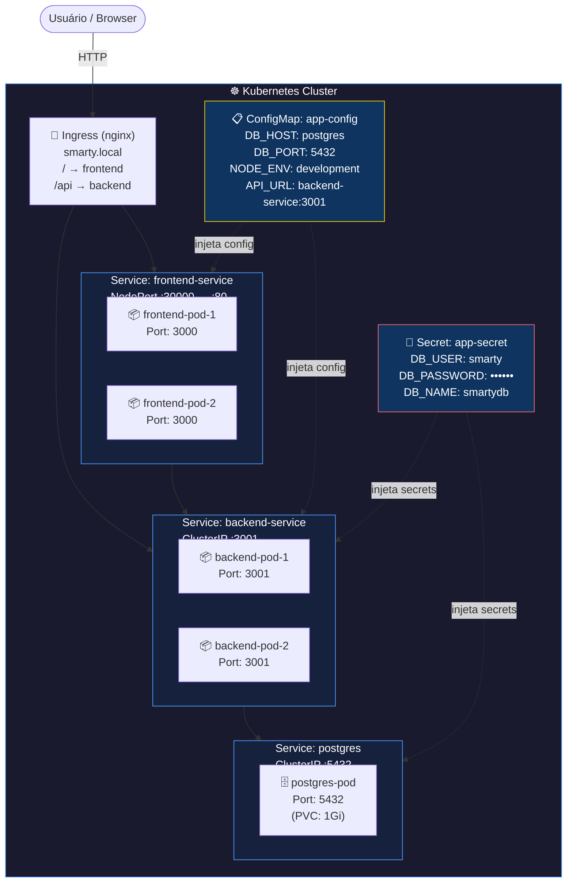

# Diagrama de Arquitetura — Kubernetes (Smarty Entregas)

## Descrição dos Componentes

| Componente | Tipo | Réplicas | Porta |
|-----------|------|----------|-------|
| frontend | Deployment | 2 | 3000 → NodePort 30000 |
| backend | Deployment | 2 | 3001 (ClusterIP) |
| postgres | Deployment | 1 | 5432 (ClusterIP) |
| Ingress | Ingress | — | 80 (HTTP) |
| app-config | ConfigMap | — | — |
| app-secret | Secret | — | — |

## Fluxo de Comunicação

1. **Usuário** acessa `http://smarty.local` ou `http://localhost:30000`
2. **Ingress** roteia `/` para o `frontend-service` e `/api` para o `backend-service`
3. **Frontend** (2 réplicas) consome a API do **Backend** via `backend-service:3001`
4. **Backend** (2 réplicas) lê configurações do **ConfigMap** e credenciais do **Secret**
5. **Backend** conecta ao **PostgreSQL** via `postgres:5432`
6. **PostgreSQL** persiste dados em volume (`PersistentVolumeClaim` de 1Gi)
